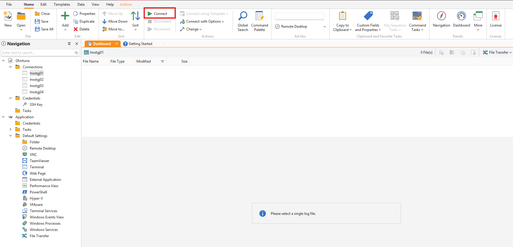

# Guida all'Onboarding dei Software aziendali

Nel seguente documento troverai una panoramica della configurazione di base del software che utilizziamo nella nostra azienda , con i vari programmi che utilizziamo, affiancati da una spiegazione e una guida all'intallazione.

# Indice

1. **[Gestione Password](#gestione-password)**

2. **[Microsoft Office](#microsoft-office)**

3. **[Royal TS](#royal-ts)**

4. **[Visual Studio Code](#visual-studio-code)**

5. **[WinSCP/FileZilla](#winscp-filezilla)**
   

6. **[HeidiSQL](#heidisql)**
 

## Gestione Password

### Creazione di password sicure 

La creazione di password sicure è essenziale per proteggere i propri account online. Una password robusta dovrebbe essere lunga almeno 12-16 caratteri e includere lettere maiuscole, minuscole, numeri e simboli speciali. Evita parole comuni, nomi personali o date facilmente intuibili. Puoi utilizzare frasi casuali o un password manager per generare e memorizzare password complesse. Cambia regolarmente le tue password e attiva, dove possibile, l’autenticazione a due fattori (2FA) per una protezione aggiuntiva. Ricorda: più una password è complessa e unica, più sarà difficile da violare.

### Lastpass

LastPass è un gestore di password sicuro che consente di salvare, generare e accedere in modo rapido e protetto a tutte le proprie credenziali di accesso. Le password vengono memorizzate in un "vault" protetto da crittografia AES-256 bit e sono accessibili solo tramite una master password che l'utente deve ricordare. L'app è disponibile come estensione per browser, applicazione desktop e app mobile, garantendo la sincronizzazione tra dispositivi.

Utilizziamo LastPass per garantire la sicurezza centralizzata delle password e semplificare l'accesso ai vari servizi utilizzati dal team. Ecco i principali motivi della scelta:

**Sicurezza avanzata:** Le password sono crittografate localmente (AES-256 bit), quindi nemmeno LastPass ha accesso ai dati.

**Accesso multi-dispositivo:** Le credenziali sono disponibili su PC, smartphone e tablet, garantendo la massima flessibilità.

**Autenticazione a due fattori (2FA):** Protezione aggiuntiva per accedere all'account LastPass.

**Condivisione sicura:** Possibilità di condividere password con i membri del team senza rivelarle in chiaro.

**Gestione dei permessi:** Possiamo decidere quali utenti del team possono visualizzare, utilizzare o modificare determinate password.

### Come si usa?

**<u>Installazione</u>**

**Browser:** Installa l'estensione LastPass per il browser (Chrome, Firefox, Edge, ecc.).

**Desktop:** Scarica l'app per desktop se preferisci gestire le password anche senza browser.

**<u>Primo Accesso</u>**

**1** Accedi a LastPass utilizzando le credenziali fornite dall'azienda.

**2** Imposta la tua master password: deve essere forte e unica.

**3** Attiva l'autenticazione a due fattori (2FA) seguendo le istruzioni.

**<u>Aggiungere una nuova password</u>**

**1** Apri l'estensione del browser o l'app desktop.

**2** Clicca su "Aggiungi elemento" e seleziona il tipo di elemento (sito web, app, ecc.).

**3** Inserisci il nome del sito, l'URL, il nome utente e la password.

**4** Salva l'elemento e LastPass si occuperà di memorizzarlo in modo sicuro.

**<u>Condividere una password</u>**

**1** Vai nel vault di LastPass e seleziona la password da condividere.

**2** Clicca su "Condividi" e inserisci l'email del destinatario.

**3** Decidi se consentire o meno al destinatario di visualizzare la password.

## Microsoft Office

Abbiamo scelto Microsoft Office perché l'intero ecosistema aziendale è basato su Microsoft 365, che include la gestione di email e dominio aziendale. Questo garantisce una perfetta integrazione con strumenti essenziali come Word, Excel, PowerPoint e Teams, semplificando la collaborazione tra i membri del team. Inoltre, Office offre una migliore gestione dei permessi e della sicurezza, permettendo un controllo accurato sugli accessi ai file condivisi. La scelta di Microsoft rispetto a Google è stata dettata dalla necessità di una maggiore personalizzazione, sicurezza e continuità operativa in linea con le esigenze aziendali.

## Royal TS 

Royal TS è un potente strumento di gestione remota che consente agli utenti di accedere in modo sicuro ai loro sistemi remoti utilizzando vari protocolli come RDP, VNC, SSH e HTTP/S. È ideale per amministratori di server, ingegneri di sistema, sviluppatori e lavoratori IT che devono accedere frequentemente a sistemi remoti1. Royal TS è disponibile su diverse piattaforme, tra cui Windows, macOS, iOS e Android, e consente di creare documenti compatibili tra tutte le versioni. Offre funzionalità avanzate di gestione delle credenziali, automazione dei compiti e condivisione sicura dei dati.

In azienda abbiamo deciso di scegliere Royal TS, a discapito dei suoi competitor, perchè ci offre i seguenti vantaggi:

1. **<u>Gestione centralizzata delle connessioni (SSH, SFTP, ecc.)</u>**
    
    **• Multi-protocollo:** Supporta non solo SSH, ma anche RDP (desktop remoto), VNC, SFTP e connessioni a web server (HTTP/HTTPS).
    
    **• Gestione delle connessioni** in un'unica interfaccia: Puoi organizzare tutte le connessioni (server Linux, Windows, dispositivi di rete, ecc.) in un'unica interfaccia visiva, con cartelle e alberi gerarchici.
  
    **• Condivisione delle connessioni:** Puoi esportare e condividere i file di configurazione (.rtsz) con altri membri del team (utile per ambienti collaborativi).

2. **<u>Organizzazione e gestione avanzata delle credenziali</u>**
   
    **• Separa le credenziali dalle connessioni:** Puoi gestire le credenziali in modo centralizzato e riutilizzarle per più connessioni, il che riduce gli errori.
   
    **• Crittografia avanzata delle credenziali:** Le credenziali sono crittografate localmente e protette da una password principale.
   
    **• Gestione multi-utente:** Ogni membro del team può avere accesso a connessioni diverse senza necessariamente condividere le credenziali.

3. **<u>Sicurezza</u>**
   
    **• Integrazione con password manager:** Può integrarsi con strumenti di gestione delle password come KeePass o LastPass.
   
    **• Supporto per autenticazione a chiave SSH:** Puoi gestire le chiavi SSH direttamente da Royal TS, senza doverle configurare manualmente.
  
    **• Autenticazione multi-fattore (MFA):** Supporta l'autenticazione multi-fattore, migliorando la sicurezza degli accessi.

### Installazione

**<u>1. Requisiti</u>**
- **Sistema Operativo**: Windows 10 o superiore  
- **Permessi**: Utente con privilegi di amministratore (per l'installazione)  

---

**<u>2. Download</u>**
1. Vai al sito ufficiale: [https://www.royalapps.com/](https://www.royalapps.com/)  
2. Clicca su **Download** e seleziona **Royal TS for Windows**.  

---

**<u>3. Installazione</u>**
1. Esegui il file `.msi` scaricato (doppio clic).  
2. Segui la procedura guidata:  
   - **Accetta i termini di licenza**.  
   - **Scegli la directory di installazione** (puoi lasciare quella predefinita).  
   - Clicca su **Avanti** e poi su **Installa**.  
3. Attendi il completamento e clicca su **Fine**.  

---

**<u>4. Prima configurazione</u>**
1. Avvia Royal TS.  
2. Se richiesto, scegli la **licenza gratuita** (limitazioni sulle connessioni) o inserisci la tua **chiave di licenza**.  
3. Configura la lingua (se necessario) e imposta le preferenze iniziali.  

Crea un nuovo documento per memorizzare le tue connessioni :

Assegna un nome al documento e fai click su OK.

Seleziona il documento o una cartella nel tuo documento e crea una nuova connessione:

In questo esempio aggiungiamo una nuova connessione terminale. Inserisci l'indirizzo ip corretto per la nuova connessione.

Seleziona la connessione e clicca Connect:

## Visual Studio Code

Visual Studio Code (VS Code) è un editor di codice open-source, leggero e altamente personalizzabile, sviluppato da Microsoft. Grazie al vasto marketplace di estensioni, può essere trasformato in un vero e proprio IDE completo, supportando strumenti di controllo della versione (Git), integrazioni SSH e l'esecuzione di script. La sua leggerezza e velocità lo rendono ideale sia per sviluppatori web che per sistemisti, permettendo di lavorare su file di configurazione, script di automazione e gestione di server remoti.

Ci sono vari IDE che ti permettono di scrivere codice, ma Visual Studio è il più vasto per numero di estensioni e linguaggi supportati, per questo in azienda utilizziamo prevalentemente questo editor.

**<u>Vantaggi sistemisti</u>**

 1. Gestione dei file di configurazione 

- VS Code supporta una vasta gamma di linguaggi di configurazione come YAML, JSON, INI, Bash, PowerShell e file di configurazione Nginx o Apache. 
- La colorazione della sintassi e il controllo degli errori in tempo reale (grazie alle estensioni) aiutano a evitare errori di sintassi. 
- Funzionalità di linting e formattazione automatica per file di configurazione complessi. 
 
 2. Gestione script e automazione 

- I sistemisti scrivono spesso script Bash o PowerShell per automatizzare i task quotidiani. VS Code offre il debug integrato per entrambi. 
- Supporto per Ansible e Terraform, utili per il provisioning e la gestione delle infrastrutture. 
 
 3. Controllo della versione (Git) 

- I file di configurazione spesso richiedono versionamento e tracciamento delle modifiche. L'integrazione con Git permette di vedere la cronologia e fare rollback. 
 
 4. Estensioni utili per i sistemisti         
- Remote 
- SSH: connessione diretta a macchine remote. 
- Docker: gestione e debug dei container Docker. 
- YAML: supporto per la sintassi YAML (es. per Docker Compose o Ansible). - Nginx Syntax Highlighting: evidenziazione della sintassi per Nginx. - Bash IDE: supporto avanzato per gli script Bash.

**<u>Vantaggi sviluppo</u>**

 1. Sviluppo e Debugging del Codice 

- VS Code supporta una vasta gamma di linguaggi di programmazione come JavaScript, Python, Java, C++, e molti altri, con funzionalità di completamento automatico e controllo degli errori in tempo reale. 
- Il potente debugger integrato permette di eseguire il codice passo-passo, impostare breakpoint, e ispezionare variabili, semplificando il processo di debugging.
 
2. Integrazione con Git e Controllo di Versione 
 
 - Supporto integrato per Git che consente di eseguire operazioni di controllo versione come commit, push, pull e gestione dei rami direttamente dall'editor. 
 - Visualizzazione delle differenze tra versioni di file, cronologia delle modifiche e possibilità di fare rollback, migliorando la gestione del codice sorgente. 
 
  3. Personalizzazione tramite Estensioni 
 
 - Un vasto marketplace di estensioni permette di aggiungere nuove funzionalità, come supporto per ulteriori linguaggi, strumenti di debugging, integrazioni con servizi cloud, e molto altro. 
 - Gli sviluppatori possono personalizzare l'editor con temi e impostazioni specifiche per adattarlo alle proprie esigenze e preferenze.

 ### Installazione

**<u>Requisiti di Sistema</u>**

- Sistema operativo: Windows 8, 10, 11
- RAM: almeno 1 GB
- Spazio su disco: 200 MB

**<u>Passaggi di Installazione</u>**

**1. Scarica Visual Studio Code**

- Vai alla pagina di download: [Visual Studio Code - Download](https://code.visualstudio.com/Download)
- Seleziona la versione per Windows e scarica l'installer.

**2. Installa Visual Studio Code**

- Esegui il file scaricato (`VSCodeSetup.exe`).
- Segui le istruzioni della procedura guidata di installazione.
- Durante l'installazione, seleziona le opzioni aggiuntive desiderate (es. creare un'icona sul desktop).

**3. Avvia Visual Studio Code**

- Al termine dell'installazione, avvia VS Code dall'icona sul desktop o dal menu Start.

## WinScp/FileZilla

WinSCP e FileZilla sono client FTP, SFTP e SCP utilizzati per trasferire file tra computer locali e server remoti. Consentono di caricare, scaricare e gestire file direttamente sui server, facilitando l'amministrazione remota. Entrambi offrono un'interfaccia grafica intuitiva, con una visuale a doppio pannello (locale e remoto) per semplificare il drag & drop dei file. Sono strumenti essenziali per sistemisti e sviluppatori, permettendo di gestire file di configurazione, log e contenuti web in modo rapido e sicuro.

In azienda , verngono utilizzati tutti e due i client, di FileZilla viene utilizzata solo la versione a pagamento in quanto la versione gratuita ha riscontrato un problema di sicurezza , mentre l'alternativa è WinSCP.

**<u>Installazione FileZilla</u>**

<u> Requisiti di Sistema </u>
- **Sistema Operativo**: Windows, macOS, Linux
- **Connessione Internet**: Necessaria per il download

**1. Scaricare FileZilla**

Visita il [sito ufficiale di FileZilla](https://filezilla-project.org/download.php) e scarica la versione adatta al tuo sistema operativo.

**2. Installare FileZilla su Windows**
1. Apri il file `.exe` scaricato.
2. Segui le istruzioni della procedura guidata di installazione.
3. Accetta i termini e le condizioni.
4. Scegli la cartella di destinazione e clicca su "Installa".
5. Al termine dell'installazione, clicca su "Fine".

**3. Configurazione Iniziale**
1. Avvia FileZilla.
2. Vai su **File > Site Manager**.
3. Clicca su **New Site** e inserisci i dettagli del server FTP:
   - **Host**: Indirizzo del server FTP
   - **Port**: Porta del server (di solito 21)
   - **Protocol**: FTP - File Transfer Protocol
   - **Logon Type**: Normal
   - **User**: Nome utente FTP
   - **Password**: Password FTP
4. Clicca su **Connect** per connetterti al server.

**<u>Installazione Winscp</u>**

<u> Requisiti di Sistema </u>
- **Sistema Operativo**: Windows, macOS, Linux
- **Connessione Internet**: Necessaria per il download

**1. Scaricare WinSCP**

Visita il [sito ufficiale di WinScp](https://winscp.net/eng/download.php) e scarica la versione adatta al tuo sistema operativo.

**2. Installare WinSCP su Windows**
1. Apri il file `.exe` scaricato.
2. Segui le istruzioni della procedura guidata di installazione.
3. Accetta i termini e le condizioni.
4. Scegli la cartella di destinazione e clicca su "Installa".
5. Al termine dell'installazione, clicca su "Fine".

**3. Configurazione Iniziale**
1. Avvia WinSCP.
2. Vai su **Session > New Session**.
3. Inserisci i dettagli del server FTP:
   - **Host name**: Indirizzo del server FTP
   - **Port number**: Porta del server (di solito 21)
   - **File protocol**: FTP
   - **User name**: Nome utente FTP
   - **Password**: Password FTP
4. Clicca su **Login** per connetterti al server.

## HeidiSQL

HeidiSQL è un software gratuito e open-source per la gestione di database. È compatibile con vari sistemi di database
come MariaDB, MySQL, Microsoft SQL Server, PostgreSQL, SQLite e Interbase/Firebird12. Con HeidiSQL, puoi 
connetterti a questi database, modificare dati e strutture, creare e gestire tabelle, viste, routine memorizzate, trigger ed eventi pianificati

**<u>Installazione HeidiSQL</u>**

<u>Requisiti di Sistema</u>
- **Sistema Operativo**: Windows
- **Connessione Internet**: Necessaria per il download

**1. Scaricare HeidiSQL**

Visita  [sito ufficiale di HeidiSQL](https://www.heidisql.com/download.php) e scarica la versione adatta al tuo sistema operativo.

**2. Installare HeidiSQL su Windows**
1. Apri il file `.exe` scaricato.
2. Segui le istruzioni della procedura guidata di installazione.
3. Accetta i termini e le condizioni.
4. Scegli la cartella di destinazione e clicca su "Installa".
5. Al termine dell'installazione, clicca su "Fine".

**3. Configurazione Iniziale**
1. Avvia HeidiSQL.
2. Si aprirà la finestra **Session Manager**.
3. Clicca su **New** per creare una nuova sessione.
4. Inserisci i dettagli della connessione al database:
   - **Network type**: Scegli il tipo di database (es. MySQL, MariaDB, PostgreSQL).
   - **Hostname / IP**: Inserisci l'indirizzo del server del database.
   - **User**: Inserisci il nome utente del database.
   - **Password**: Inserisci la password del database.
   - **Database**: (Opzionale) Inserisci il nome del database a cui vuoi connetterti.
5. Clicca su **Save** per salvare la sessione e poi su **Open** per connetterti al database.

