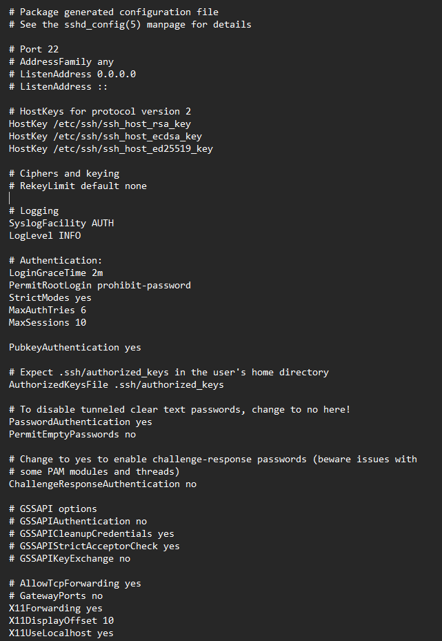
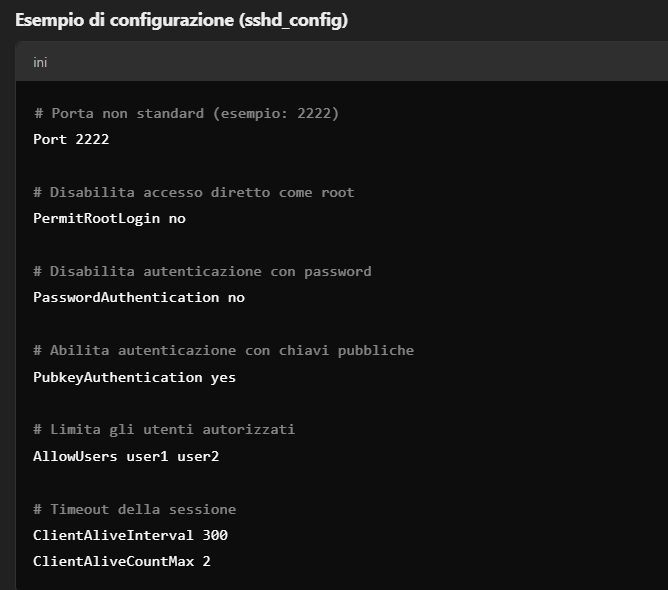

# Introduzione

## Cos’è SSH

SSH (Secure Shell) è un protocollo di rete crittografato che consente di stabilire connessioni sicure e protette tra due dispositivi. Utilizzato principalmente per accedere in modo remoto a server e dispositivi di rete, SSH fornisce un'autenticazione robusta e supporta l'accesso remoto sicuro , l'esecuzione dei comandi , il trasferimento di file, il controllo degli accessi, ecc. Il protocollo è stato sviluppato per sostituire strumenti non sicuri come Telnet e rlogin, che trasmettevano le informazioni (inclusi username e password) in chiaro, rendendole facilmente intercettabili. Con SSH, tutto il traffico viene cifrato, rendendo molto più difficile intercettare o manipolare i dati scambiati.

## Come funziona? TCP/IP

SSH opera sulla suite di protocolli TCP/IP, che costituisce la base della maggior parte delle comunicazioni su Internet. TCP sta per Transmission Control Protocol, mentre IP significa Internet Protocol. Questi due protocolli lavorano insieme per formattare, instradare e distribuire i pacchetti di dati. 

L'IP fornisce informazioni cruciali, come l'indirizzo IP a cui deve essere inviato un pacchetto (simile a un indirizzo postale), mentre il TCP specifica la porta a cui il pacchetto deve essere inviato all'interno di un determinato indirizzo IP (paragonabile al piano di un edificio o al numero di un appartamento). TCP è un protocollo di livello di trasporto, responsabile del trasferimento e della distribuzione dei pacchetti di dati. 

Oltre a TCP/IP, vengono spesso utilizzati protocolli aggiuntivi per garantire che i dati vengano trasmessi in un formato utilizzabile dalle applicazioni. SSH è uno di questi protocolli. Altri esempi includono HTTP, FTP e SMTP.

SSH utilizza il protocollo TCP (trasmission Control Protocol) anzichè UDP principalmente per garantire una connessione sicura e affidabile, per i seguenti motivi:

1. **Affidabilità**: TCP fornisce un sistema di trasmissione dati affidabile, con controllo degli errori e garanzia che i pacchetti di dati arrivino in ordine e senza perdite.

2. **Connessione stabile**:TCP stabilisce una connessione prima di trasferire i dati, garantendo che entrambi i dispositivi (client e server) siano pronti a comunicare.

3. **Sicurezza**:Le funzionalità di controllo del flusso e di rilevamento degli errori di TCP aiutano a mantenere la connessione SSH sicura, prevenendo attacchi come l'injection di pacchetti malevoli. UDP, non avendo queste caratteristiche, sarebbe meno sicuro per una connessione SSH.


# Installazione e configurazione di base

## Installazione

1. **Aggiorna il sistema:**
   ```bash
   sudo apt update && sudo apt upgrade -y
   ```
2. **Installa il server SSH:**
   ```bash
   sudo apt install openssh-server -y
   ```
3. **Verifica lo stato del servizio SSH:**
   ```bash
   sudo systemctl status ssh
   ```
4. **Se il servizio non è attivo, avvialo e abilitalo all'avvio:**
   ```bash
   sudo systemctl start ssh
   sudo systemctl enable ssh
   ```

## File principale di configurazione

Il file principale di configurazione si trova in:
```
/etc/ssh/sshd_config
```
Di seguito è riportato un esempio di configurazione di **defualt**:



Le prime modifiche che solitamente si applicate per rendere un minimo più sicuro il protocollo , sono le seguenti:



Dopo aver modificato il file, riavvia il servizio SSH:
```bash
sudo systemctl restart ssh
```


# Autenticazione

## Concetti di base

L'autenticazione SSH è il processo che consente di verificare l'identità di un utente o di un sistema remoto prima di concedere l'accesso a una macchina. È fondamentale per garantire la sicurezza degli accessi remoti, prevenire intrusioni non autorizzate e proteggere le comunicazioni. Un sistema di autenticazione solido è essenziale per ridurre il rischio di attacchi di forza bruta e di accessi illeciti.

## Autenticazione a chiave pubblica/privata

L'autenticazione a chiave pubblica/privata è una delle forme più sicure e utilizzate per accedere ai server SSH. Funziona attraverso una coppia di chiavi:

- **Chiave privata**: conservata in modo sicuro sul client e mai condivisa.
- **Chiave pubblica**: copiata sul server remoto e inserita nel file `~/.ssh/authorized_keys`.

Quando l'utente tenta di connettersi, il server utilizza la chiave pubblica per verificare che il client possieda la chiave privata corrispondente. Se la verifica ha esito positivo, l'accesso viene concesso. Questo sistema elimina la necessità di inviare password in rete e offre una maggiore protezione contro gli attacchi di forza bruta. Inoltre, permette di automatizzare gli accessi remoti, come l'esecuzione di script o il trasferimento di file, senza richiedere l'intervento umano.

## Creazione della coppia di chiavi

1. **Genera la coppia di chiavi SSH:**
   ```bash
   ssh-keygen -t rsa -b 4096 -C "email@example.com"
   ```
2. **Copia la chiave pubblica sul server:**
   ```bash
   ssh-copy-id -i ~/.ssh/id_rsa.pub user@server_ip
   ```
3. **Verifica la connessione al server:**
   ```bash
   ssh user@server_ip -p 2222
   ```

## Configurazione delle chiavi sul server

- **File delle chiavi pubbliche degli utenti:**
  ```
  /home/<utente>/.ssh/authorized_keys
  ```
- **Chiave privata del server:**
  ```
  /etc/ssh/ssh_host_rsa_key
  ```
- **Chiave pubblica del server:**
  ```
  /etc/ssh/ssh_host_rsa_key.pub
  ```

Verifica i permessi dei file e delle directory:
```bash
chmod 700 /home/<utente>/.ssh
chmod 600 /home/<utente>/.ssh/authorized_keys
```
# Sicurezza

Applicare le pratiche di sicurezza per proteggere il servizio SSH è fondamentale perché questo protocollo è spesso utilizzato per gestire server e dispositivi remoti. Senza adeguate misure di sicurezza, si rischiano accessi non autorizzati, furti di dati sensibili, e potenziali danni ai sistemi gestiti. Implementare pratiche di sicurezza solide contribuisce a mantenere l'integrità e la disponibilità dei servizi, proteggendo sia le risorse che gli utenti collegati, garantendo un ambiente operativo sicuro e affidabile.

## Best practices

- **Utilizzare solo l'autenticazione a chiave pubblica**
- **Modificare la porta predefinita**
- **Disabilitare l'accesso root diretto**
- **Monitorare regolarmente i log**
- **Backup delle chiavi SSH** (protezione e backup delle chiavi private)
- **Aggiornamento del server SSH** (importanza di aggiornare regolarmente OpenSSH)

# Comandi SSH utili

## Comandi di base

- **Connettersi a un server remoto**:
  ```bash
  ssh user@server_ip
  ```
- **Copiare file da locale a remoto**:
  ```bash
  scp file.txt user@server_ip:/path/destinazione/
  ```
- **Copiare file da remoto a locale**:
  ```bash
  scp user@server_ip:/path/file.txt /path/destinazione/
  ```
- **Eseguire comandi remoti**:
  ```bash
  ssh user@server_ip "comando"
  ```

## Comandi avanzati

- **Sincronizzare file con rsync**:
  ```bash
  rsync -avz /path/local/ user@server_ip:/path/remoto/
  ```

  Rsync è un'utilità di trasferimento file che sincronizza file e directory tra due location. Usato con SSH, permette di trasferire dati in modo sicuro e cifrato, garantendo l'integrità e la sicurezza dei file durante il trasferimento.

- **Connettersi a un server FTP con SFTP**:
  ```bash
  sftp user@server_ip
  ```

  Ftp (File Transfer Protocol) è un protocollo per trasferire file tra client e server su una rete. Quando è configurato con SSH (SFTP), fornisce un metodo sicuro per trasferire file, criptando i dati e le credenziali di accesso per evitare intercettazioni.
# Troubleshooting SSH

## Connessione Rifiutata
**Errore**: `Connection refused`

**Possibili Cause**:
- Il servizio SSH non è in esecuzione sul server.
- Firewall o regole di sicurezza bloccano la porta SSH.

**Soluzioni**:
- Verifica se il servizio SSH è in esecuzione:
  ```sh
  sudo systemctl status ssh
- Se non è attivo, avvialo con:

  ```sh
  sudo systemctl start ssh
- Controlla le regole del firewall:

  ```sh
  sudo ufw status
  sudo ufw allow ssh
## Permessi Negati
**Errore**: `Permission denied (publickey)`

**Possibili Cause:**

- Chiavi SSH non configurate correttamente.

- Problemi di permessi dei file delle chiavi.

**Soluzioni:**

Assicurati che la chiave privata sia nel percorso corretto e con i permessi appropriati:

```bash
chmod 600 ~/.ssh/id_rsa
```

Verifica che la chiave pubblica sia nel file **~/.ssh/authorized_keys sul server.**

Verifica che la chiave pubblica sia nel file **~/.ssh/authorized_keys sul server.**
## Fingerprint sconosciuta o cambiata
**Errore**: `Warning: remote host identification has changed!`

**Possibili Cause:**

- Il server SSH è stato reinstallato o aggiornato.

- Un attacco "Man-in-the-middle" potrebbe essere in corso.

- La chiave host sul server è stata cambiata.

**Soluzioni:**

1. **Verifica l'integrità del server**: - Assicurati che non ci sia un attacco in corso e che la chiave host sia stata cambiata intenzionalmente.

 2. **Rimuovi l'entrata vecchia del server**:
  - Usa il comando: 
  ```sh 
     ssh-keygen -R indirizzo_del_server 
   ```
   - Oppure modifica manualmente il file `~/.ssh/known_hosts` per rimuovere la riga corrispondente al server.

# Royal TS

In azienda utilizziamo Royal TS per la gestione centralizzata delle connessioni SSH, semplificando l'accesso sicuro ai nostri server. Questa applicazione ci permette di configurare chiavi pubbliche/privati, automatizzare le sessioni e gestire credenziali in modo organizzato. Grazie a Royal TS, possiamo applicare SSH in modo più efficiente, garantendo sicurezza e facilità d'uso.


<video width="640" height="360" controls autoplay loop muted>
  <source src="./Progetto video.mp4" type="video/mp4">
</video>